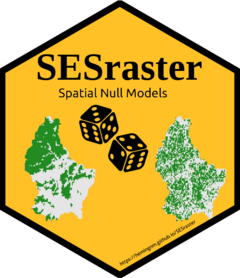

<!-- badges: start -->

[](https://cran.r-project.org/package=SESraster) [](https://cran.r-project.org/package=SESraster) [](https://cran.r-project.org/package=SESraster) [](https://github.com/HemingNM/SESraster/actions/workflows/R-CMD-check.yaml) [](https://app.codecov.io/gh/HemingNM/SESraster)

<!-- badges: end -->

# SESraster <a href="https://hemingnm.github.io/SESraster/"></a>

Randomization of presence/absence species distribution raster data for calculating standardized effect sizes and testing null hypothesis. The randomization algorithms are based on classical algorithms for matrices (Gotelli 2000, <doi:10.2307/177478>) implemented for raster data.

<br>

### Installation

To install the package, run:

```         
install.packages("SESraster")
```

The development version can be installed from the [`Github`](https://github.com/HemingNM/SESraster) repository:

```         
require(devtools)
install_github("HemingNM/SESraster", build_vignettes = TRUE)
```

<br>

### SESraster basics

Basic information about the package can be found below, at the [package's webpage](https://hemingnm.github.io/SESraster/), or in the vignettes
`browseVignettes("SESraster")`
<br>

- #### Null model algorithms
`vignette("null-models")`: For an overview of the null model algorithms for 
species co-occurrence analysis summarized in (Gotelli 2000, <doi:10.2307/177478>).

- #### Spatial null model algorithms in SESraster
`vignette("spatial-null-models")`: Get started with `SESraster`. 
See installation instructions and how the implemented null model algorithms work with spatial data.

- #### Standardized effect sizes
`vignette("SES")`: For computing standardized effect sizes (SES) using the implemented null model algorithms.

<br>

### Citation

- If you use this R package, please cite in your publications: <br>

Heming N. M., Mota F. M. M., Alves-Ferreira G. (2023). SESraster: Raster Randomization for Null Hypothesis Testing. R package version 0.7.0, <https://CRAN.R-project.org/package=SESraster>
<br>

- For more information:

```         
citation("SESraster")
```

<br>

### Issues

If you have any question or find any bug, let us know through the topic ["Issues"](https://github.com/HemingNM/SESraster/issues).

<br>
